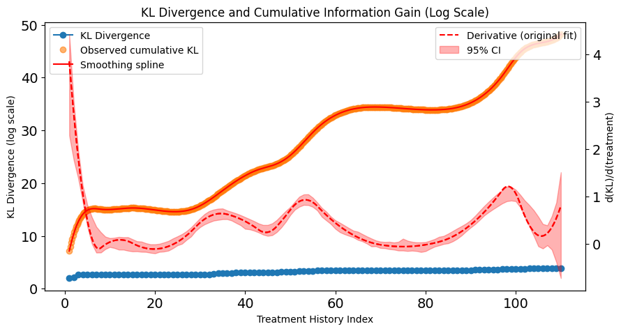
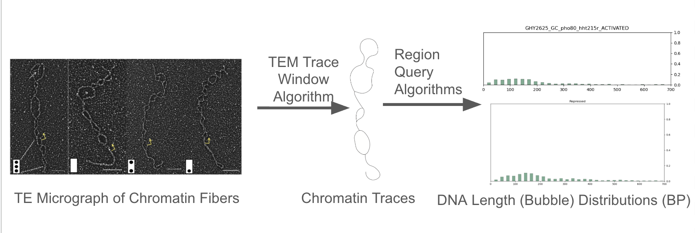

<h1>Welcome!</h1>

Welcome to my website hosted on GitHub Pages! Here, you will find a bit about me, descriptions of the projects I am most proud of, and a link to my blog on Substack. 

To navigate to each item, click the pages on the top right, or click the cards below. 

  <!-- For the acne project -->
  <a href="currentprojects/acnemodelingproject/" class="project-card">
    
    
Quantifying Acne Severity Dynamics: A Bayesian and KL Divergence Based Predictive Model

    
Click to view details

  </a>
  
  <!-- For the class tracking platform project -->
  <a href="currentprojects/classtrackingplatform/" class="project-card">
    
    
The Class Data Tracking and Report Generation Platform

    
Click to view details

  </a>
 
  <!-- For the GeneRing project -->
  <a href="pastprojects/mygenering/" class="project-card">
    
    
Kinetic Proofreading and Dynamic Nucleosome Structure in S. cerevisae

    
Click to view details

  </a>

<!-- <h2>Current Projects</h2>
<ul>
  <li>Class Data Tracking and Report Generation Platform </li>
  <li>Quantifying Acne Severity Dynamics - A Bayesian and KL Divergence Framework</li>
</ul>

<h2>Past Projects</h2>
<ul>
  <li>Kinetic Proofreading and Dynamic Nucleosome Structure in S. cerevisae </li>
  <li>Bioinformatics Models/Algorithms Toolkit</li>
  <li>Molecular Biology Common Figures Generation Toolkit </li>
  <li>Primary Sequence Analysis/Protein Parameters Python Toolkit</li>
  
</ul> -->

Check out my Github profile (<a href="https://github.com/nathaniel-wolff">GitHub</a>) for repositories.

